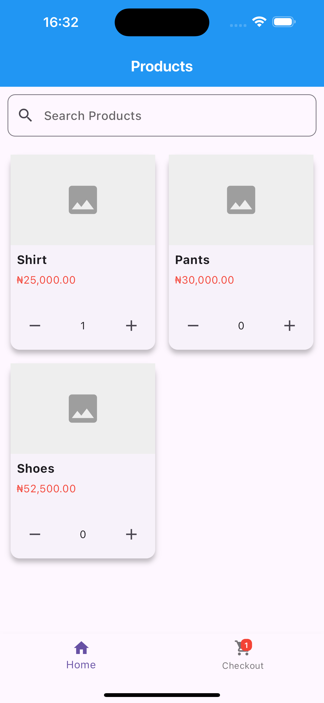

# Shopping App

A simple shopping application built with Flutter. This app allows users to browse products, add them to a cart, and proceed to checkout. The app also includes an order success page after a successful checkout.

## Features

- Browse a list of products.
- Add and remove products from the cart.
- View the cart summary and subtotal.
- Swipe to remove items from the cart.
- Checkout and view an order success page.

## Screenshots

